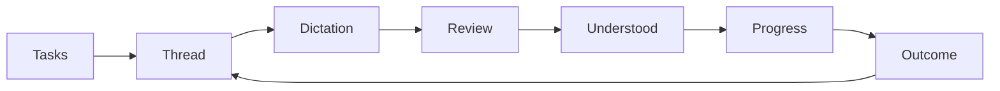

# Voice Agent HTML Mock

## Goal

Validate the mobile voice-agent experience with a self-contained interactive HTML mock before choosing production architecture.

## Design decisions

- The mock uses seeded in-browser data and has no secrets, storage, or external dependencies.
- Tasks contain a chat-style thread and one of: `working`, `needs-input`, or `completed`.
- The entry screen is voice-first: push-to-talk and hands-free start a new task immediately, while recent tasks remain secondary.
- Push-to-talk is primary; hands-free and typing are available from both the entry screen and thread composer.
- Live dictation is reviewable before submission.
- Agent updates prioritize understanding, completion, and requests for input; technical progress is collapsed.
- Stable task/thread concepts preserve a future path to cross-device continuation.

## Flow

## Nodes

| ID | Status | Deliverable | Done when |
| --- | --- | --- | --- |
| G | done | Interactive HTML mock | Core and edge states can be explored in a mobile browser |

## Boundary

This phase changes only `mock.html` and this plan. Next.js, Fastify, OpenAI integrations, persistence, authentication, and deployment are deferred until the UX direction is approved.
