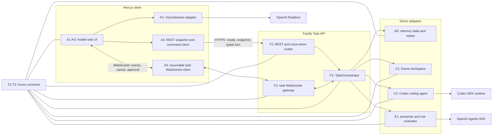
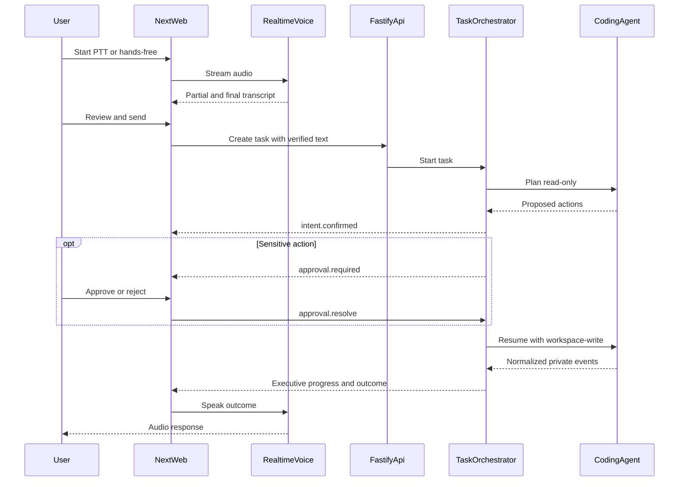
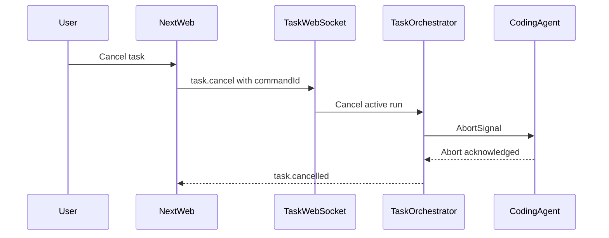
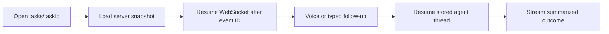
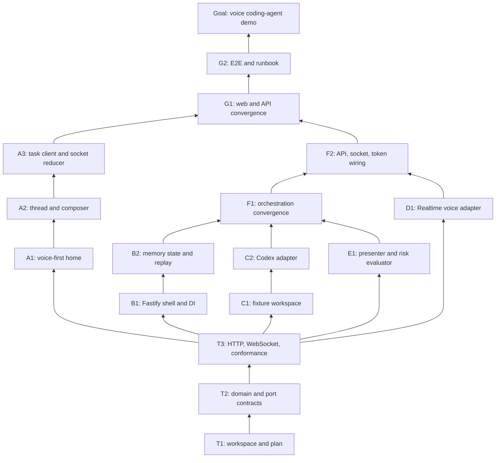

# Voice Coding Agent Demo

## Goal

Build the mobile-first experience validated in `mock.html`: push-to-talk and
hands-free task creation, reviewable transcripts, task switching, concise
agent progress, cancellation, sensitive-action approval, and text plus audio
outcomes. The demo operates on copied local fixture repositories while keeping
every external capability behind a production-swappable interface.

## Design decisions

- **Workspace:** Node 22+, pnpm workspaces, and strict TypeScript. Applications
  live in `apps/`; contracts and adapter implementations live in `packages/`.
- **Dependency direction:** web and API code depend on contracts and ports,
  never on each other or on concrete adapter internals.
- **Schemas:** Zod schemas are the runtime and compile-time source for domain
  DTOs, WebSocket messages, errors, config, and model output.
- **Voice:** the browser uses OpenAI Realtime over WebRTC with a short-lived
  token minted by Fastify. Push-to-talk commits manually. Hands-free uses VAD
  but does not submit until the transcript is reviewed.
- **Coding agent:** Fastify runs `@openai/codex-sdk` against a disposable copy
  of a local fixture repository. Every task first plans read-only. Safe or
  approved plans resume with workspace-write access and no network.
- **Progress:** raw agent/tool output remains private. The browser receives
  only understood, working, needs-input, completed, failed, or cancelled
  executive updates. Technical detail is summarized and collapsed.
- **Transport:** REST creates tasks, submits the basic typed fallback, and
  loads snapshots. One resumable WebSocket sends events and accepts only
  subscribe, cancel, and approval-resolution commands.
- **Cancellation:** each active run has an `AbortController`. Cancellation is
  idempotent, prevents later writes/events, and ends in `cancelled`.
- **Sensitive actions:** an `ActionRiskEvaluator` checks the read-only plan.
  Destructive actions pause in `needs_input`; approval resumes the same agent
  thread, while rejection terminates it without writes.
- **Demo persistence:** tasks and bounded event replay are process-local and
  server-authoritative. Stable user/task/turn/workspace/thread IDs keep the
  future Postgres and cross-device path open.
- **Authentication:** localhost uses a fixed `demo-user`. Services receive an
  `ActorContext` so production auth can replace this without changing use cases.
- **Configuration and secrets:** Fastify validates `OPENAI_API_KEY`, `PORT`,
  `WEB_ORIGIN`, and `DEMO_REPO_ID`. Long-lived keys never enter browser code.
- **Errors:** all boundaries use
  `{ code, message, retryable, requestId, details? }`. Contracts pin 400
  invalid input, 404 missing task/workspace, 409 active turn or invalid state,
  422 unsupported fixture, 503 unavailable dependency, and 500 internal error.
- **Workspace security:** fixture sources are immutable. Each task receives a
  disposable contained copy; path escape and unapproved write attempts fail.
- **Continuity:** `/tasks/[taskId]` is deep-linkable. A second client loads the
  server snapshot and resumes events from its last event ID.
- **Typing:** remains a functional shared turn mode, but voice receives the
  demo's design and test priority.
- **Runbook:** root `README.md` is the canonical setup and demo runbook. Every
  node that changes commands, environment, ports, fixtures, or operational
  limitations updates it in the same PR.

## Frozen trunk contracts

T2 and T3 freeze these contracts before parallel branches begin:

- `TaskStatus = queued | working | needs_input | completed | failed | cancelled`.
- `Task`, `Turn`, `ExecutiveUpdate`, `ApprovalRequest`, `TaskSnapshot`, and
  `TechnicalSummary`; turn mode is `ptt | handsfree | typing`.
- Server messages: `connection.ready`, `task.snapshot`, `task.created`,
  `turn.created`, `intent.confirmed`, `progress.updated`, `approval.required`,
  `approval.resolved`, `task.status_changed`, `task.completed`,
  `task.cancelled`, `task.failed`, `resync_required`, and typed `error`.
- Client messages: `task.subscribe`, `task.cancel`, and `approval.resolve`.
  Mutation commands carry a `commandId` for idempotent retries.
- Ports: `TaskStore`, `TaskEventLog`, `WorkspaceProvider`, `CodingAgent`,
  `ExecutivePresenter`, `ActionRiskEvaluator`, `TaskRunRegistry`, and browser
  `VoiceSession`.
- `CodingAgent.plan/run/resume()` accepts an `AbortSignal` and emits normalized
  `CodingEvent` values. `WorkspaceProvider.acquire()` returns an opaque lease.
- REST: `GET /tasks`, `POST /tasks`, `GET /tasks/:id`,
  `POST /tasks/:id/turns`, `GET /tasks/:id/events?after=`, `GET /ws`, and
  `POST /voice/client-secret`.
- Contract tests cover invalid transitions, missing IDs, overlapping turns,
  idempotent cancel/approval, stale/rejected approval, adapter outages, path
  escape, WebSocket order/replay/resync, and malformed messages.

## Target architecture

## Runtime flows

### Voice task and approval

### Cancellation

### Resume and follow-up

## Dependency graph

## Node register

| ID | Status | Deliverable and files | Acceptance criterion | Risk | Est. size |
| --- | --- | --- | --- | --- | --- |
| T1 | done | Revised plan, root README, and pnpm/TypeScript baseline | Done when documented setup and recursive lint, typecheck, test, and build commands succeed | low | 300 |
| T2 | done | `packages/contracts`: domain schemas, status machine, errors, eight ports | Done when invalid transitions and malformed adapter values are rejected | medium | 350 |
| T3 | done | Contract transport schemas, OpenAPI, replay rules, conformance suites | Done when a fake system passes every success and pinned failure contract | high | 400 |
| A1 | pending | `apps/web`: Next.js voice-first home and recent tasks | Done when mobile tests show voice actions before recent tasks and navigation works | medium | 350 |
| A2 | pending | `apps/web`: thread, review sheet, voice controls, cancel/approval, basic typing | Done when component tests cover review, working, cancel, approval, and outcomes | medium | 400 |
| A3 | pending | `apps/web`: typed REST/WebSocket client and reducer | Done when replayed events reconstruct state and commands retry idempotently | high | 380 |
| B1 | pending | `apps/task-api`: Fastify shell, config, errors, DI seams | Done when injection tests verify health and every pinned HTTP error | low | 300 |
| B2 | pending | `packages/task-store-memory`: state, replay, active-run registry | Done when conformance covers overlap, replay, command retry, and abort cleanup | medium | 380 |
| C1 | pending | `fixtures` and `packages/workspace-fixture`: isolated fixture leases | Done when tests prove source immutability, task isolation, and path containment | high | 350 |
| C2 | pending | `packages/coding-agent-codex`: plan/run/resume/abort adapter | Done when Codex plans read-only, resumes writes, tests fixture, and cancels cleanly | high | 400 |
| D1 | pending | `packages/voice-openai`: Realtime `VoiceSession` | Done when fake transport covers PTT, hands-free, interruption, and speech | high | 380 |
| E1 | pending | `packages/executive-openai`: presenter and risk evaluator | Done when destructive plans pause, safe plans proceed, and raw logs never leak | high | 380 |
| F1 | pending | Task orchestration convergence | Done when tests cover safe run, approve/reject, stale approval, cancel, resume, and failure | high | 400 |
| F2 | pending | REST/WebSocket/token route convergence | Done when a client creates, follows, cancels, and approves a task | high | 400 |
| G1 | pending | Real web/API/voice convergence | Done when mobile completes safe, cancelled, and approved-sensitive voice paths | high | 400 |
| G2 | pending | Fixture E2E, startup script, README, production adapter map | Done when a fresh checkout runs all golden demo paths | medium | 350 |
| G | pending | Accepted fixture-repository voice coding-agent demo | Done when all goal capabilities work and final checks pass | medium | 0 |

## Branch and agent boundaries

- **Trunk:** T1 → T2 → T3; root config, this file, and
  `packages/contracts/**`. T3 freezes shared contracts.
- **Branch A:** A1 → A2 → A3; only `apps/web/**` until G1.
- **Branch B:** B1 → B2; only `apps/task-api/**` and
  `packages/task-store-memory/**` until F1.
- **Branch C:** C1 → C2; only `fixtures/**`,
  `packages/workspace-fixture/**`, and `packages/coding-agent-codex/**`.
- **Branch D:** D1; only `packages/voice-openai/**`.
- **Branch E:** E1; only `packages/executive-openai/**`.
- T1, T2, and T3 merge before branches A-E start. Changing a frozen contract
  requires a plan-revision PR naming all dependent branches.

## Convergence and collapse

- At F1, branch B survives; C and E stop after orchestration conformance passes.
- At F2, branch B survives; D stops after socket and token wiring passes.
- At G1, branch A survives; B stops. A owns G2 and G.
- Conformance tests are rerun at each convergence. No two agents work above the
  same convergence point.

## Review and execution policy

- Each node is one reviewable PR and updates only its own table row to `done`
  with the PR link.
- A node that changes setup, configuration, ports, commands, fixtures, or demo
  behavior updates `README.md`; stale run instructions fail acceptance.
- Agents open PRs but do not merge or enable auto-merge. The user merges.
- Nodes may stack only within one branch and cannot merge ahead of their base.
- If an attempted node reveals a prerequisite, revert the attempt, record the
  edge and reason here, recurse to a true leaf, and seek approval for any branch
  or contract restructuring.

## Red-team result

- Parallel branch file sets are disjoint; shared DTOs and failure behavior are
  trunk work.
- Route registration, dependency wiring, and WebSocket lifecycle remain in B
  until convergence to avoid application hotspot conflicts.
- Codex events, local paths, OpenAI transport objects, and raw model output
  cannot escape their adapters.
- WebSocket controls are deliberately limited to subscribe, cancel, and
  approval. General live steering is deferred.
- In-memory state cannot survive API restart; stable IDs and store/event ports
  make this an explicit demo adapter limitation rather than a domain constraint.
- Codex abort support is verified in C2 before adapter implementation. If the
  installed SDK cannot abort, C2 adds a process-wrapper implementation behind
  the unchanged port.
- Browser voice requires mic permission and HTTPS outside localhost; the final
  runbook includes both constraints.
- Live OpenAI tests are opt-in. CI uses injected fakes and never needs secrets.
