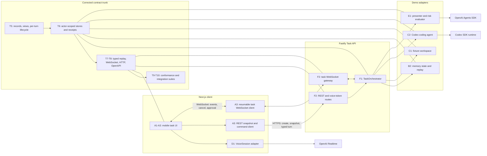
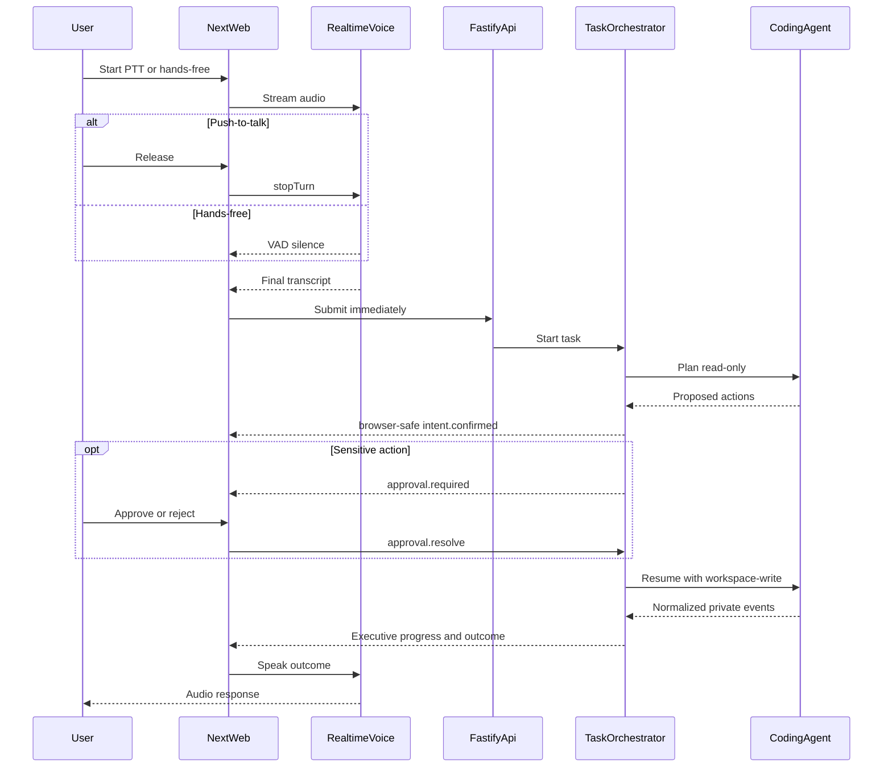
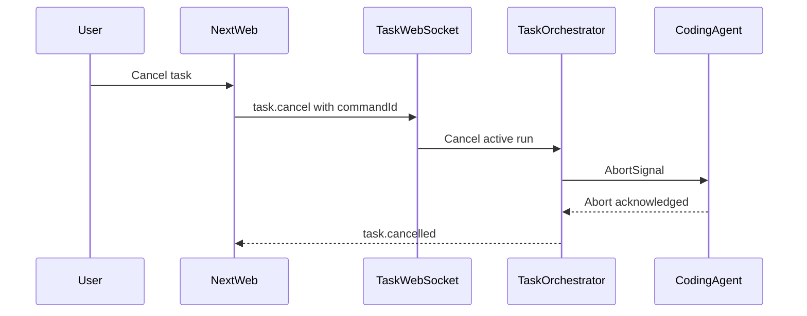
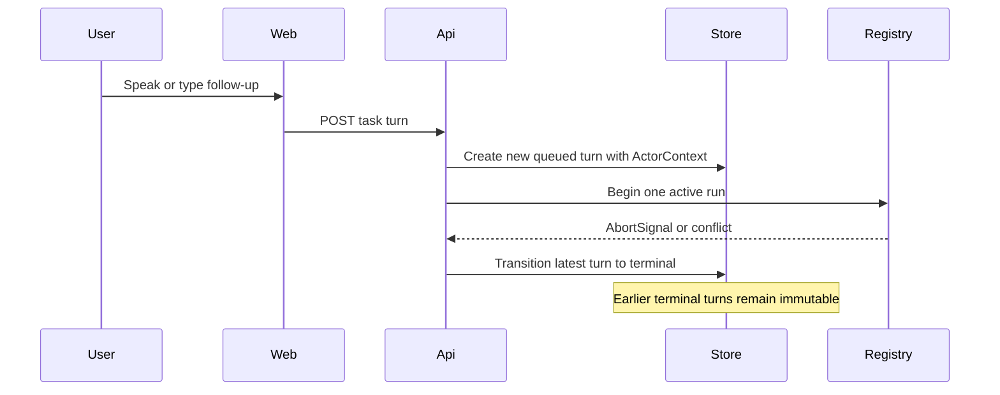
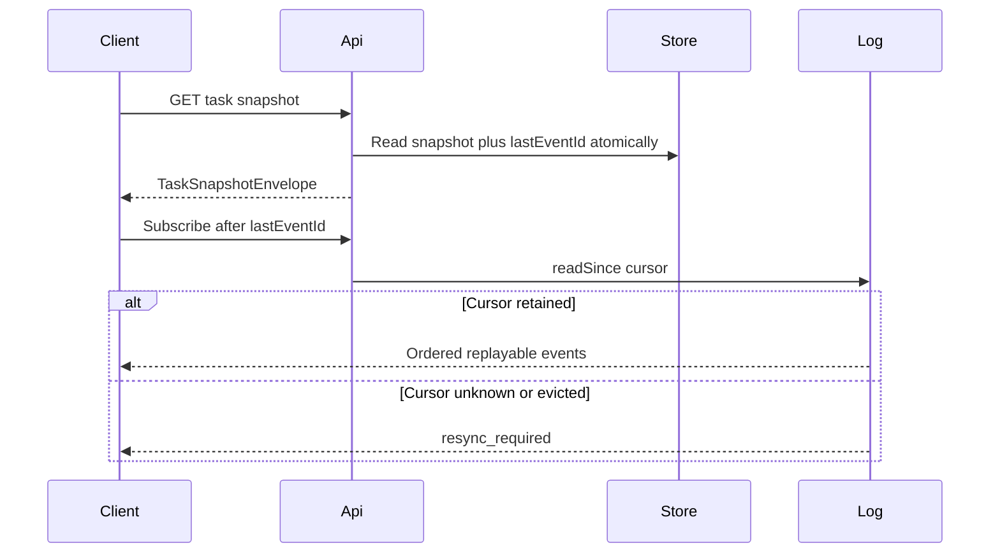
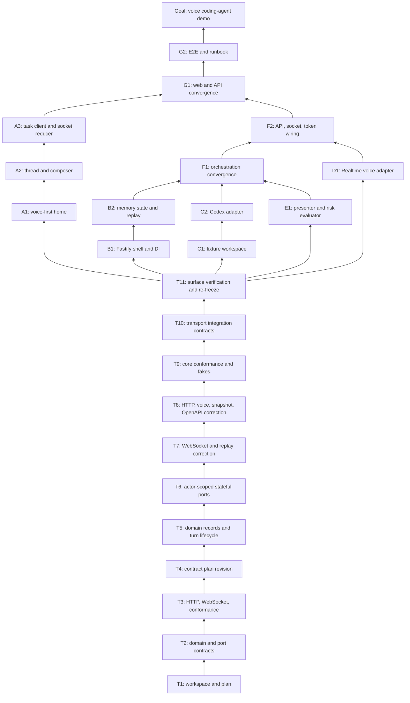

# Voice Coding Agent Demo

## Goal

Build the mobile-first experience validated in `mock.html`: push-to-talk and
hands-free task creation with immediate submission when speech ends, task switching, concise
agent progress, cancellation, sensitive-action approval, and text plus audio
outcomes. The demo operates on copied local fixture repositories while keeping
every external capability behind a production-swappable interface.

## Design decisions

- **Workspace:** Node 22+, pnpm workspaces, and strict TypeScript. Applications
  live in `apps/`; contracts and adapter implementations live in `packages/`.
- **Dependency direction:** web and API code depend on contracts and ports,
  never on each other or on concrete adapter internals.
- **Schemas:** Zod schemas are the runtime and compile-time source for domain
  DTOs, WebSocket messages, errors, config, and model output.
- **Voice:** the browser uses OpenAI Realtime over WebRTC with a short-lived
  token minted by Fastify. Releasing push-to-talk commits audio and its final
  transcript submits immediately. Hands-free submits each final transcript on
  VAD silence. There is no transcript review step.
- **Lifecycle:** execution state belongs to each `Turn`, not to the persistent
  task conversation. A terminal turn remains immutable; a later follow-up
  creates a new queued turn. `TaskView.status` is derived from the latest turn,
  and `TaskRunRegistry` still permits only one active turn per task.
- **Public and internal task data:** `TaskRecord` contains server-only
  `actorId`, `workspaceId`, and `agentThreadId`; `TaskView` contains only
  browser-safe task identity, title, derived status, and timestamps.
- **Workspace selection:** shared contracts contain no `fixtureId`. The demo
  resolves `DEMO_REPO_ID` server-side to a stable `workspaceId`; production may
  resolve the same opaque ID from actor policy. `POST /tasks` does not accept a
  repository selector.
- **Workspace lease:** `leaseId` is opaque. The demo lease also exposes
  `rootPath` because the current Codex SDK requires a local working directory;
  replacing that demo-specific handoff with an injected resolver is deferred.
- **Coding agent:** Fastify runs `@openai/codex-sdk` against a disposable copy
  of a local fixture repository. Every task first plans read-only. Safe or
  approved plans resume with workspace-write access and no network.
- **Progress:** raw agent/tool output remains private. The browser receives
  only understood, working, needs-input, completed, failed, or cancelled
  executive updates. Technical detail is summarized and collapsed.
- **Transport:** REST creates tasks, submits the basic typed fallback, and
  loads snapshots. One resumable WebSocket sends events and accepts only
  subscribe, cancel, and approval-resolution commands.
- **Cancellation:** each active run has an `AbortController`. Cancellation is
  idempotent, prevents later writes/events, and ends in `cancelled`.
- **Sensitive actions:** an `ActionRiskEvaluator` checks the read-only plan.
  Destructive actions pause in `needs_input`; approval resumes the same agent
  thread, while rejection cancels that turn without writes. Approval records
  persist `pending | approved | rejected | superseded`; stale or wrong-state
  resolution fails with `conflict`.
- **Demo persistence:** tasks and bounded event replay are process-local and
  server-authoritative. Stable user/task/turn/workspace/thread IDs keep the
  future Postgres and cross-device path open.
- **Authentication:** localhost uses a fixed `demo-user`. Services receive an
  `ActorContext { actorId }` so production auth can replace this without
  changing use cases. Wrong-actor reads and mutations return `not_found`.
- **Snapshot ownership:** the task store owns tasks, turns, executive updates,
  and approval records. Snapshot reads return the state and `lastEventId`
  atomically so a reconnect cannot miss an event between load and subscribe.
- **Command idempotency:** cancel and approval commands are keyed by actor plus
  `commandId`. A repeated ID with the same payload returns the original result;
  the same ID with a different payload fails with `conflict`. Successful result
  messages echo `commandId`.
- **Replay:** only task events enter the replay log; connection, snapshot,
  resync, and error messages never do. Event-log reads return `replay` or
  `resync_required`. `GET /tasks/:id/events` requires an `after` cursor; fresh
  clients load a snapshot first.
- **Configuration and secrets:** Fastify validates `OPENAI_API_KEY`, `PORT`,
  `WEB_ORIGIN`, and `DEMO_REPO_ID`. Long-lived keys never enter browser code.
- **Errors:** all boundaries use
  `{ code, message, retryable, requestId, details? }`. Contracts pin 400
  invalid input, 404 missing task/workspace, 409 active turn or invalid state,
  503 unavailable dependency, and 500 internal error. Public `details` is
  bounded JSON-safe data; internal causes never cross the wire.
- **Workspace security:** fixture sources are immutable. Each task receives a
  disposable contained copy; path escape and unapproved write attempts fail.
- **Continuity:** `/tasks/[taskId]` is deep-linkable. A second client loads the
  server snapshot and resumes events from its last event ID.
- **Typing:** remains a functional shared turn mode, but voice receives the
  demo's design and test priority.
- **Runbook:** root `README.md` is the canonical setup and demo runbook. Every
  node that changes commands, environment, ports, fixtures, or operational
  limitations updates it in the same PR.

## Revised frozen trunk contracts

T2 and T3 merged before review exposed production and flow mismatches. T4-T11
are the approved plan-revision stack; they supersede the affected T2/T3
contracts before parallel branches may continue:

- `TurnStatus = queued | working | needs_input | completed | failed | cancelled`.
- Internal `TaskRecord`; public `TaskView`; status-bearing `Turn`;
  `ExecutiveUpdate`, persisted `ApprovalRecord`, browser-safe
  `ApprovalRequest`, `TaskSnapshot`, `TaskSnapshotEnvelope`, and
  `TechnicalSummary`; turn mode is `ptt | handsfree | typing`.
- Server messages: `connection.ready`, `task.snapshot`, `task.created`,
  `turn.created`, `intent.confirmed`, `progress.updated`, `approval.required`,
  `approval.resolved`, `turn.status_changed`, `task.completed`,
  `task.cancelled`, `task.failed`, `resync_required`, and typed `error`.
  Replayable messages are a strict subset excluding connection, snapshot,
  resync, and error messages.
- Client messages: `task.subscribe`, `task.cancel`, and `approval.resolve`.
  Mutation commands and successful results carry a `commandId`.
- Ports: actor-scoped `TaskStore`, typed `TaskEventLog`, `CommandReceiptStore`,
  `WorkspaceProvider`, `CodingAgent`, `ExecutivePresenter`,
  `ActionRiskEvaluator`, `TaskRunRegistry`, and browser `VoiceSession`.
- `CodingAgent.plan/run/resume()` accepts an `AbortSignal` and emits normalized
  `CodingEvent` values. Demo `WorkspaceProvider.acquire()` returns an opaque
  lease identity plus the local `rootPath` required by Codex.
- REST: `GET /tasks`, `POST /tasks`, `GET /tasks/:id`,
  `POST /tasks/:id/turns`, `GET /tasks/:id/events?after=`, `GET /ws`, and
  `POST /voice/client-secret`.
- Failure modes: wrong actor/missing IDs return 404; active-turn, stale
  approval, changed-payload command retry, and illegal turn transition return
  409; stale replay cursors return a 200 `resync_required`; dependency outages
  return 503; unexpected failures return 500.
- Contract tests cover turn transitions and follow-ups, actor isolation,
  overlapping turns, idempotent cancel/approval, stale/rejected approval,
  adapter outages, path escape, voice finalization, mid-run abort, WebSocket
  order/replay/resync, strict replayable unions, and malformed messages.

## Target architecture

## Runtime flows

### Voice task and approval

### Cancellation

### Resume and follow-up

### Snapshot and replay

## Dependency graph

## Node register

| ID | Status | Deliverable and files | Acceptance criterion | Risk | Est. size |
| --- | --- | --- | --- | --- | --- |
| T1 | done | Revised plan, root README, and pnpm/TypeScript baseline | Done when documented setup and recursive lint, typecheck, test, and build commands succeed | low | 300 |
| T2 | done | `packages/contracts`: domain schemas, status machine, errors, eight ports | Done when invalid transitions and malformed adapter values are rejected | medium | 350 |
| T3 | done ([PR #2](https://github.com/jv8-alt/voice-agent/pull/2)) | Initial transport schemas, OpenAPI, replay rules, and conformance suites | Done when the initial transport contract surface is available for red-team review | high | 400 |
| T4 | done ([PR #3](https://github.com/jv8-alt/voice-agent/pull/3)) | Plan revision for reviewed domain, replay, voice, identity, and disclosure gaps; `MIKADO.md` only | Done when all replacement decisions, failure modes, architecture, flows, dependencies, boundaries, and acceptance criteria are approved | medium | 220 |
| T5 | done (direct merge) | `packages/contracts`: split `TaskRecord`/`TaskView`, status-bearing turns, approval/action views | Done when any terminal turn can be followed by a new queued turn without mutating prior turns | high | 360 |
| T6 | done (direct merge) | Actor-scoped task/snapshot store, workspace contract, approval records, command receipt port, safe errors | Done when wrong-actor access is `not_found`, approval state persists, and duplicate command behavior is deterministic | high | 390 |
| T7 | done (direct merge) | Replayable WebSocket union, typed event log, canonical event IDs, cursor policy, command correlation | Done when unknown or evicted cursors resync and non-replayable messages cannot enter the event log | high | 390 |
| T8 | done (direct merge) | HTTP snapshot envelope, required replay cursor, auto-submit voice contract, OpenAPI correction | Done when generated paths and every pinned response match revised schemas with no fixture vocabulary | high | 360 |
| T9 | done (direct merge) | Core port conformance and reference fakes | Done when actor isolation, follow-up, destructive risk, resume, mid-abort, voice finalization, approval, and dedupe suites pass | high | 400 |
| T10 | done (direct merge) | WebSocket, HTTP, replay, stale approval, and command integration contract tests | Done when the fake transport system passes every revised success and failure path | high | 400 |
| T11 | done (direct merge) | Production barrel cleanup, runbook contract notes, full contract verification | Done when recursive lint, typecheck, test, and build pass and downstream branches import only intended subpaths | low | 180 |
| A1 | pending | `apps/web`: Next.js voice-first home and recent tasks | Done when mobile tests show voice actions before recent tasks and navigation works | medium | 350 |
| A2 | pending | `apps/web`: thread, auto-submit voice controls, cancel/approval, basic typing | Done when component tests cover immediate voice submission, working, cancel, approval, and outcomes | medium | 400 |
| A3 | pending | `apps/web`: typed REST/WebSocket client and reducer | Done when replayed events reconstruct state and commands retry idempotently | high | 380 |
| B1 | pending | `apps/task-api`: Fastify shell, config, errors, DI seams | Done when injection tests verify health and every pinned HTTP error | low | 300 |
| B2 | pending | `packages/task-store-memory`: state, replay, active-run registry | Done when conformance covers overlap, replay, command retry, and abort cleanup | medium | 380 |
| C1 | pending | `fixtures` and `packages/workspace-fixture`: isolated fixture leases | Done when tests prove source immutability, task isolation, and path containment | high | 350 |
| C2 | pending | `packages/coding-agent-codex`: plan/run/resume/abort adapter | Done when Codex plans read-only, resumes writes, tests fixture, and cancels cleanly | high | 400 |
| D1 | pending | `packages/voice-openai`: Realtime `VoiceSession` | Done when fake transport covers PTT, hands-free, interruption, and speech | high | 380 |
| E1 | pending | `packages/executive-openai`: presenter and risk evaluator | Done when destructive plans pause, safe plans proceed, and raw logs never leak | high | 380 |
| F1 | pending | Task orchestration convergence | Done when tests cover safe run, approve/reject, stale approval, cancel, resume, and failure | high | 400 |
| F2 | pending | REST/WebSocket/token route convergence | Done when a client creates, follows, cancels, and approves a task | high | 400 |
| G1 | pending | Real web/API/voice convergence | Done when mobile completes safe, cancelled, and approved-sensitive voice paths | high | 400 |
| G2 | pending | Fixture E2E, startup script, README, production adapter map | Done when a fresh checkout runs all golden demo paths | medium | 350 |
| G | pending | Accepted fixture-repository voice coding-agent demo | Done when all goal capabilities work and final checks pass | medium | 0 |

## Branch and agent boundaries

- **Trunk:** T1 → T2 → T3 → T4 → T5 → T6 → T7 → T8 → T9 → T10 → T11;
  root config, this file, and `packages/contracts/**`. T11 re-freezes the
  corrected shared contracts.
- **Revision execution:** T4-T11 run sequentially in one detached worktree on
  stacked `mikado/T*` branches because their contract and test files overlap.
  Existing detached A-E worktrees remain paused and untouched through T11.
- **Branch A:** A1 → A2 → A3; only `apps/web/**` until G1.
- **Branch B:** B1 → B2; only `apps/task-api/**` and
  `packages/task-store-memory/**` until F1.
- **Branch C:** C1 → C2; only `fixtures/**`,
  `packages/workspace-fixture/**`, and `packages/coding-agent-codex/**`.
- **Branch D:** D1; only `packages/voice-openai/**`.
- **Branch E:** E1; only `packages/executive-openai/**`.
- T11 merges before branches A-E start or resume. T4 names every affected
  branch (A-G); changing the corrected freeze after T11 requires another
  plan-revision PR.

## Convergence and collapse

- At F1, branch B survives; C and E stop after orchestration conformance passes.
- At F2, branch B survives; D stops after socket and token wiring passes.
- At G1, branch A survives; B stops. A owns G2 and G.
- Conformance tests are rerun at each convergence. No two agents work above the
  same convergence point.

## Review and execution policy

- Each node is one reviewable PR and updates only its own table row to `done`
  with the PR link.
- A node that changes setup, configuration, ports, commands, fixtures, or demo
  behavior updates `README.md`; stale run instructions fail acceptance.
- Agents open PRs but do not merge or enable auto-merge. The user merges.
- **Explicit exception:** on 2026-07-24 the user authorized T5-T11 to be
  combined, committed, and merged directly to `main` without PRs.
- Nodes may stack only within one branch and cannot merge ahead of their base.
- If an attempted node reveals a prerequisite, revert the attempt, record the
  edge and reason here, recurse to a true leaf, and seek approval for any branch
  or contract restructuring.

## Red-team result

- T3 was merged as PR #2 while this revision was being planned. The correction
  stack therefore starts from that merge; the superseded branch is not amended
  or force-pushed.
- T4-T11 repeatedly touch shared schemas, exports, and dependent tests, so
  attempted parallelism was removed. One sequential trunk agent owns the
  correction; branches A-G are affected and remain paused.
- `TaskRecord` lands before actor-scoped stores; stores land before wire
  snapshots; replay types land before HTTP/OpenAPI; conformance starts after
  all revised interfaces exist.
- The demo's local `rootPath` requirement is an explicit exception to full
  workspace opacity rather than a hidden production claim.
- Snapshot state plus cursor is an atomic implementation requirement and has an
  integration conformance test before the corrected freeze.
- Wrong actor, missing ID, stale approval, changed-payload command retry,
  unknown/evicted cursor, malformed message, and mid-run abort all have pinned
  failure behavior.
- `fixtureId`, `agentThreadId`, raw commands/tool output, and arbitrary error
  causes cannot cross public wire schemas.
- Route registration, dependency wiring, and WebSocket lifecycle remain in B
  until convergence to avoid application hotspot conflicts.
- Codex events, OpenAI transport objects, and raw model output cannot escape
  their adapters. The demo-only lease `rootPath` crosses only the
  WorkspaceProvider-to-CodingAgent port handoff.
- WebSocket controls are deliberately limited to subscribe, cancel, and
  approval. General live steering is deferred.
- In-memory state cannot survive API restart; stable IDs and store/event ports
  make this an explicit demo adapter limitation rather than a domain constraint.
- Codex abort support is verified in C2 before adapter implementation. If the
  installed SDK cannot abort, C2 adds a process-wrapper implementation behind
  the unchanged port.
- Browser voice requires mic permission and HTTPS outside localhost; the final
  runbook includes both constraints.
- Live OpenAI tests are opt-in. CI uses injected fakes and never needs secrets.
