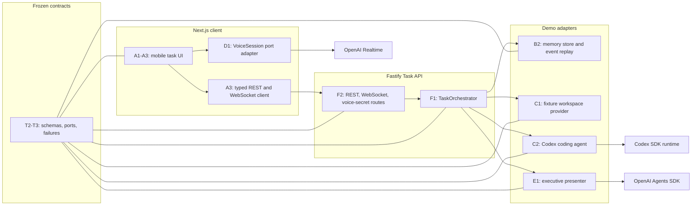
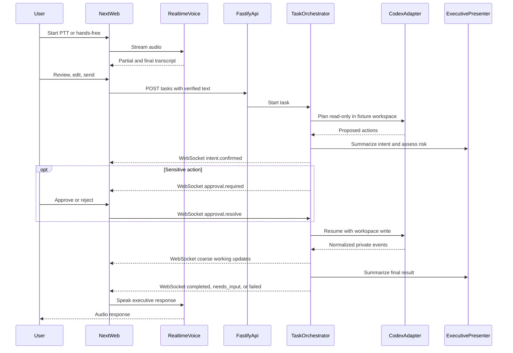
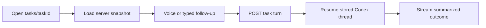
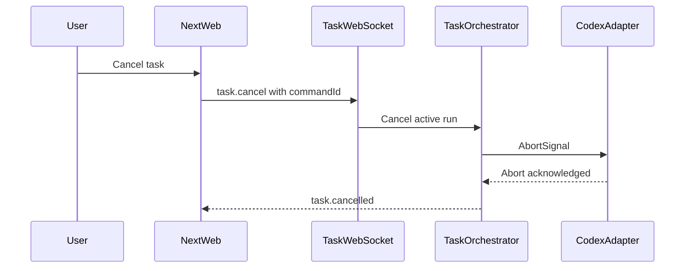
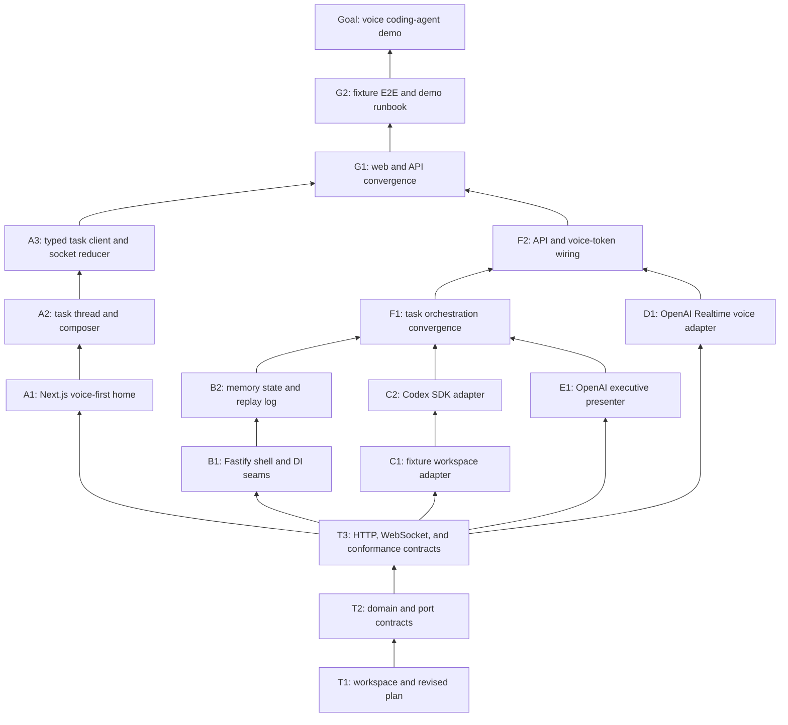

# Voice Agent Demo Plan

## Goal and scope
Implement the approved experience in [mock.html](mock.html): voice-first task creation, push-to-talk and hands-free dictation, transcript review, inline follow-ups, recent-task switching, executive progress cards, text plus audio responses, cancellation, sensitive-action approval, and future cross-device-ready task URLs. Typing remains a functional fallback but receives no dedicated polish beyond a simple composer. The demo operates on copied local fixture repositories; production auth, durable storage, remote repositories, and hardened containers are adapter swaps, not demo requirements.

## Design decisions
- **Workspace:** Node 22 + pnpm workspaces, TypeScript strict mode; [MIKADO.md](MIKADO.md) is revised before application code and [mock.html](mock.html) remains the UX reference.
- **Packages:** `apps/web`, `apps/task-api`, and narrow packages for contracts and each adapter. Apps import ports/contracts, never concrete siblings.
- **Schemas:** Zod is the single runtime/type source for domain DTOs, WebSocket messages, errors, config, and OpenAI structured outputs.
- **Voice:** `@openai/agents/realtime` in the browser over WebRTC. Fastify mints short-lived client secrets; the API key never reaches browser code. PTT uses manual commit; hands-free uses VAD with automatic response generation disabled so users can review text before sending.
- **Coding agent:** server-side `@openai/codex-sdk`, one resumable Codex thread per task, no network, and a copied fixture repository as the only writable root. Every task starts with a read-only planning turn; only a safe or explicitly approved plan resumes with `workspace_write`.
- **Progress:** raw Codex/tool events remain server-only. The UI receives `understood`, coarse `working`, `needs_input`, `completed`, or `failed` executive updates. OpenAI Agents SDK structured output summarizes intent and final outcome; deterministic phase labels cover intermediate work to avoid repeated model calls.
- **Transport:** REST creates tasks, appends the low-priority typed fallback, and loads authoritative snapshots. One Fastify WebSocket sends ordered task events and accepts only three live commands today: subscribe/resume, cancel, and approval resolution. It uses monotonic event IDs, ping/pong heartbeat, bounded replay, and `resync_required` when replay is unavailable.
- **Cancellation:** each active run owns an `AbortController`; `task.cancel` is idempotent, aborts Codex, prevents later writes/events, and transitions the task to `cancelled`. C2 begins with a compatibility spike that verifies the installed Codex SDK propagates `AbortSignal`; failure triggers a small process-wrapper adapter rather than weakening the port.
- **Sensitive actions:** an `ActionRiskEvaluator` evaluates the read-only Codex plan before execution. Destructive operations such as mass deletion, destructive git, credential access, or broad dependency/system changes emit `approval.required` and pause in `needs_input`. `approval.resolve` either resumes the same Codex thread with write access or terminates it as rejected.
- **Demo state:** server-authoritative in-memory task store and replay event log. Stable `userId`, `taskId`, `turnId`, `workspaceId`, and Codex thread IDs preserve the Postgres/laptop path despite process-local demo persistence.
- **Authentication:** fixed `demo-user` on localhost. `ActorContext` is carried through services so production auth can replace it without changing use cases.
- **Configuration/secrets:** validated environment variables in Fastify (`OPENAI_API_KEY`, `PORT`, `WEB_ORIGIN`, `DEMO_REPO_ID`); public web config contains only Task API origin. `.env.example` contains no secrets.
- **Errors:** one typed problem shape `{ code, message, retryable, requestId, details? }`. Pin `400` invalid input, `404` task/workspace, `409` active turn or invalid transition, `422` unsupported fixture, `503` OpenAI/Codex unavailable, and `500` internal failure.
- **Demo safety:** fixture sources are immutable; each task gets a disposable copy under an ignored workspace directory. Path containment and workspace lifecycle are enforced by `WorkspaceProvider`.
- **Handoff readiness:** `/tasks/[taskId]` is deep-linkable; task/thread state comes from Fastify rather than browser memory. A second client loads a snapshot then resumes the WebSocket from its last event ID while the demo server remains running.

## Frozen trunk contracts
Define these in [packages/contracts](packages/contracts) before branch work:
- `TaskStatus = queued | working | needs_input | completed | failed | cancelled`; draft exists only in the client before first submit.
- `Task`, `Turn`, `ExecutiveUpdate`, `ApprovalRequest`, `TaskSnapshot`, and `TechnicalSummary`; turn input mode is `ptt | handsfree | typing`.
- Server WebSocket union: `connection.ready`, `task.snapshot`, `task.created`, `turn.created`, `intent.confirmed`, `progress.updated`, `approval.required`, `approval.resolved`, `task.status_changed`, `task.completed`, `task.cancelled`, `task.failed`, `resync_required`, and typed `error`. No raw agent logs cross this boundary.
- Client WebSocket union: `task.subscribe { taskId, afterEventId? }`, `task.cancel { taskId, commandId }`, and `approval.resolve { taskId, approvalId, decision, commandId }`. Command IDs make retries idempotent.
- Ports: `TaskStore`, `TaskEventLog`, `WorkspaceProvider`, `CodingAgent`, `ExecutivePresenter`, `ActionRiskEvaluator`, `TaskRunRegistry`, and browser `VoiceSession`.
- `CodingAgent.plan/run/resume()` accepts an `AbortSignal` and returns an `AsyncIterable<CodingEvent>` independent of Codex event names; `WorkspaceProvider.acquire()` returns a lease independent of local paths/containers.
- REST: `GET /tasks`, `POST /tasks`, `GET /tasks/:id`, basic `POST /tasks/:id/turns`, `GET /tasks/:id/events?after=`, `GET /ws`, and `POST /voice/client-secret`.
- Contract tests cover status transitions, unknown IDs, duplicate/overlapping turns, idempotent cancel/approval, rejected and stale approvals, adapter outage mapping, path escapes, WebSocket ordering/replay/resync, and malformed messages.

## Target architecture

## Runtime flows
### New voice task

### Follow-up and resume

### Cancellation

## Mikado dependency graph

## Node register
- **T1 — workspace and revised plan:** update [MIKADO.md](MIKADO.md), add root pnpm/TypeScript/test/lint config, workspace folders, env example, and ignore rules. Done when `pnpm install`, recursive typecheck, and empty test command succeed. Risk low; ~250 lines.
- **T2 — domain and port contracts:** add Zod domain schemas, status machine, typed error shape, six ports, and unit tests in [packages/contracts](packages/contracts). Done when invalid transitions and malformed adapter values are rejected. Risk medium; ~350 lines.
- **T3 — transport and conformance contracts:** add REST/WebSocket schemas, event replay/resync semantics, OpenAPI generation, reusable adapter conformance suites, cancellation/approval state rules, and failure fixtures. Done when an in-test fake implementation passes every contract including pinned failure modes. Risk high; ~400 lines.
- **A1 — voice-first home:** scaffold [apps/web](apps/web) and port the entry/recent-task hierarchy from [mock.html](mock.html) using seeded client data. Done when mobile Playwright proves voice actions precede recent tasks and task navigation works. Risk medium; ~350 lines.
- **A2 — thread and composer:** add thread cards, inline turns, transcript review sheet, PTT/hands-free controls, a basic typed fallback, cancel/approval cards, audio-text outcome, and all status states. Done when component tests cover draft → review → working, cancel, approval, and needs-input/completed displays; typing only needs a send smoke test. Risk medium; ~400 lines.
- **A3 — typed client and socket reducer:** add contract-derived REST client, reconnecting WebSocket client, task hooks, command acknowledgements, snapshot fallback, mock transport, and reducer tests. Done when recorded events render the correct task snapshot and retried cancel/approval commands are idempotent without importing Fastify code. Risk high; ~380 lines.
- **B1 — Fastify shell and DI seams:** scaffold [apps/task-api](apps/task-api), validated config, request IDs, CORS, health route, error mapper, and a port-only container. Done when `app.inject()` verifies health and every pinned error shape. Risk low; ~300 lines.
- **B2 — demo state adapters:** implement in-memory `TaskStore`, bounded replay `TaskEventLog`, and active `TaskRunRegistry` in isolated packages. Done when they pass T3 conformance, including overlapping-turn rejection, event replay, idempotent commands, and abort cleanup. Risk medium; ~380 lines.
- **C1 — fixture workspace:** add one small git fixture repository, copy-on-acquire leases, cleanup, path containment, and no-network policy in [fixtures](fixtures) plus its adapter package. Done when tests prove fixture immutability, task isolation, and path-escape rejection. Risk high; ~350 lines.
- **C2 — Codex adapter:** first verify installed SDK cancellation in a throwaway compatibility test; then wrap `@openai/codex-sdk`, bind each task to its lease and resumable thread ID, separate read-only planning from write execution, propagate abort, normalize streamed events, and map process/auth/sandbox failures. Done when a manual OpenAI test plans read-only, resumes to edit/test the fixture, and cancels cleanly while fake-SDK tests cover resume and errors. Risk high; ~400 lines.
- **D1 — Realtime voice adapter:** implement `VoiceSession` with ephemeral-token connection, partial/final transcript events, manual PTT commit, VAD hands-free mode, interruption, and speak/cancel; use an injectable transport for tests. Done when fake-transport tests cover both modes and no long-lived key is present in the web bundle. Risk high; ~380 lines.
- **E1 — executive presenter and risk evaluator:** implement structured intent/outcome/risk schemas with `@openai/agents`, deterministic intermediate phase summaries, sensitive-action policy, and safe fallback copy. Done when fixtures produce concise cards, destructive plans require approval, safe plans proceed, and raw logs never appear in output. Risk high; ~380 lines.
- **F1 — orchestration convergence:** compose stores, run registry, workspace, coding agent, presenter, and risk evaluator in `TaskOrchestrator`; plan read-only, pause for approvals, resume writes, abort on cancel, serialize turns, and release leases. Done when integration tests cover safe execution, approve/reject, stale approval, cancellation at each phase, follow-up/resume, completion, and dependency failure. Risk high; ~400 lines. Agent B survives; agents C and E collapse.
- **F2 — API, socket, and voice-token wiring:** implement REST/WebSocket plugins and `/voice/client-secret`, wire demo adapters, heartbeat/replay/resync, command acknowledgements, graceful shutdown, and redacted logging. Done when a client can create, follow, cancel, and approve a task and browser-safe token minting works; all contract tests pass. Risk high; ~400 lines. Agent B survives; agent D collapses.
- **G1 — web/API convergence:** replace seeded task state with the typed client, connect real voice, preserve review-before-send, deep-link task pages, resume the WebSocket, expose cancel/approval, and speak terminal responses. Done when a mobile browser completes voice tasks through safe, cancelled, and approved-sensitive paths without refresh; basic typing can submit a turn. Risk high; ~400 lines. Agent A survives; agent B collapses.
- **G2 — fixture E2E and runbook:** add Playwright golden paths for completion, cancellation, and destructive-action approval/rejection, one basic typing smoke test, startup script, README, and explicit demo limitations/production adapter map. Done when a fresh checkout can run the documented local demo and all golden paths pass. Risk medium; ~350 lines.
- **G — goal:** demo accepted when PTT, hands-free, task switching, cancellation, sensitive-action approval, inline follow-up, executive progress, text/audio outcome, same-server deep-link resume, and basic typed fallback work against the fixture repository.

## Branch and agent boundaries
- **Trunk agent:** T1 → T2 → T3; only root config, [MIKADO.md](MIKADO.md), and `packages/contracts/**`. Contract changes after T3 require a plan-revision PR naming A–E.
- **Agent A:** A1 → A2 → A3; only `apps/web/**` until G1.
- **Agent B:** B1 → B2; only `apps/task-api/**` and `packages/task-store-memory/**` until F1.
- **Agent C:** C1 → C2; only `fixtures/**`, `packages/workspace-fixture/**`, and `packages/coding-agent-codex/**`.
- **Agent D:** D1; only `packages/voice-openai/**`.
- **Agent E:** E1; only `packages/executive-openai/**`.
- At **F1**, B survives and C/E stop. At **F2**, B survives and D stops. At **G1**, A survives and B stops; A owns G2 and G. PRs may stack only within one branch and the user merges every node.

## Verification strategy
- Contracts and all adapter ports have reusable Vitest conformance suites.
- Fastify routes use `app.inject()`; WebSocket tests assert event ordering, reconnect/replay, resync, command idempotency, heartbeat, and redaction.
- OpenAI integrations use injected fake transports in CI; live tests are opt-in and require `OPENAI_API_KEY`.
- Playwright uses a mobile viewport for UX parity and a real local fixture workspace for golden E2E.
- Final checks: install, lint, typecheck, unit/integration tests, production builds, E2E, and manual PTT/hands-free audio on a mobile browser.

## Red-team result
- Parallel file sets are pairwise disjoint; voice-token route registration moved to F2 to avoid D/B overlap.
- Shared DTOs, status transitions, cancellation/approval commands, replay semantics, and all failure modes land in trunk before branch work.
- Codex-specific events, local filesystem paths, OpenAI Realtime objects, and summary model outputs cannot escape their adapters.
- In-memory persistence does not provide restart durability; this is an explicit demo limitation, while server IDs and store/event ports preserve the production and laptop path.
- Browser WebRTC requires HTTPS outside localhost and explicit mic permission; the runbook includes both constraints.
- WebSocket control is intentionally limited to subscribe/resume, cancel, and approval resolution; general steering is deferred.
- Typing remains in the shared turn contract and basic composer but has no dedicated polish, autosave, or E2E depth beyond one smoke path.
- The highest-risk leaves—WebSocket replay/resync, Codex abort/sandbox behavior, destructive-plan gating, and Realtime mode switching—are isolated early and tested behind fakes before convergence.